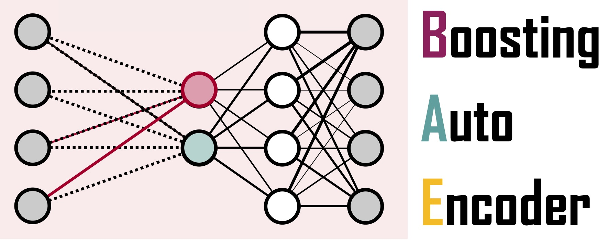

# BoostingAutoEncoder

[](https://github.com/NiklasBrunn/BoostingAutoEncoder.jl/actions/workflows/CI.yml?query=branch%3Amain)




A Julia package for training BoostingAutoencoders (BAEs) to single-cell gene expression and interaction data. 


## Introduction

The BAE was first proposed in [Hackenberg, M., Brunn, N., Vogel, T., & Binder, H. (2024). Infusing structural assumptions into dimension reduction for single-cell RNA sequencing data to identify small gene sets. bioRxiv, 2024-02](https://www.biorxiv.org/content/10.1101/2024.02.15.580085v1.abstract).


## Getting started

The package can be downloaded from this GitHub repository and added with the Julia package manager via:

```julia
using Pkg 
Pkg.add(url="https://github.com/NiklasBrunn/BoostingAutoEncoder.jl")
using scVI 
```


## ToDos:

- [ ] Finish the documentation
- [ ] Add unit tests 
- [ ] Add the `timeBAE` function
- [ ] Optimize data and model structures
- [ ] Generalize and simplify visualization functions
- [ ] Add option to differentiate through the componentwise boosting component
- [ ] Update the README 
